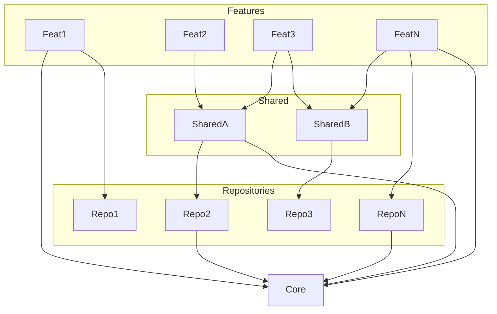

# Архитектура проекта
## Общее описание
1) core - максимально изоморфный код. Core не зависит от других частей приложения. Сюда подключаем только глобальные фичи, сквозные сервисы, глобальные токены и т.д. В core нет UI.
2) repositories - слой для получения данных. Здесь находятся модели данных. На этом же уровне валидация и маппинг внешних данных. Может зависеть только от ядра. Репозитории не могут зависеть друг от друга.
3) shared - кроссфичевый код. Расшареные компоненты, общие кроссфичевые сервисы (как пример - сервис настроек пользователя).
4) features - бизнес-фичи. Не могут зависеть друг от друга, но могут зависеть от верхних слоев. Не могут напрямую зависеть от репозиториев других фич.

## Направление зависимостей
**Зависимости направлены в одну сторону**: features -> shared -> repositories -> core. Это зафиксировано в статическом анализаторе кода.

## Арх. схема

